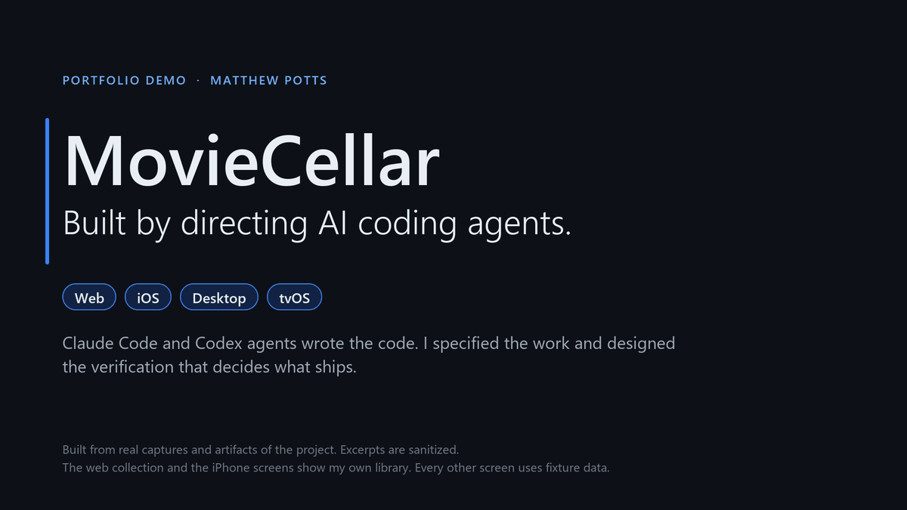

# Building with agents

## Demo

This is a 20-second tour of MovieCellar. The full 2.5-minute walkthrough is [demo/moviecellar-walkthrough.mp4](demo/moviecellar-walkthrough.mp4).

## What this is

I'm Matthew Potts, a data scientist. The agents write the code. I decide what to build, write the specs, and check the work. The agents are mostly Claude Code and Codex, running in parallel. They are fast and sometimes wrong, so the checks decide what ships.

This repo holds write-ups of three projects and the playbook I use. The code for all three is private or local only. I can walk through any of it on a call.

## Case studies

**[MovieCellar](case-studies/moviecellar.md):** A web, iOS, and desktop app plus a vision-model service. Claude Code and Codex agents built it in 5.5 months, and it is in a private beta with no real users yet. The write-up covers the orchestration rules, a release gate that rejects agent work, a two-round multi-agent security audit (process only), and the failure behind each rule.

**[Agents auditing agents](case-studies/agents-auditing-agents.md):** A five-agent adversarial audit of agent-written backtesting code. It caught look-ahead bias (a Sharpe ratio of 3.29 that was really 1.00). It then audited and repaired the evaluation harness that every result in that repo must pass. The repository is local only, and the fixes are not yet committed.

**[FlowState](case-studies/flowstate.md):** An audio-ML research project on measuring rap syllable timing, run under sealed evaluation with hash-frozen gold labels and predictions scored only after freeze. I hand-corrected the 1,061 gold labels myself. In one experiment, frontier agents improved the median error and still failed the safety screen. The repository is private, and nothing has been published or submitted.

## Playbook

The [playbook](playbook/) is the operating method I distilled from these projects. It is written so another team could adopt it.

- [Operating rules](playbook/operating-rules.md)
- [Verification tiers](playbook/verification-tiers.md)
- [An exact-candidate release gate](playbook/release-gate.md)
- [A handoff runbook](playbook/handoff-runbook.md) for resuming work across agents and vendors
- [A catalog of agent failure modes](playbook/failure-catalog.md), with the guardrail for each

## Agent operating kit

**[agent-operating-kit](https://github.com/mepotts/agent-operating-kit):** The rules and checks from the playbook, packaged as a Claude Code plugin and plain templates. It is version 0.1.0, and it has not been used on a real project yet.

## Public code

**[astronomy](https://github.com/mepotts/astronomy):** About 20 open-data research fronts, run by agents under standing verification gates.

**[exosat-rv](https://github.com/mepotts/exosat-rv):** A radial-velocity reanalysis. My own audit withdrew its headline claims.

**[llm-introspection](https://github.com/mepotts/llm-introspection):** An experiment on whether Gemma-2-2B notices a concept injected into its activations.

## Contact

**Email:** mepotts@berkeley.com

**LinkedIn:** [linkedin.com/in/matthewpotts](https://linkedin.com/in/matthewpotts)
