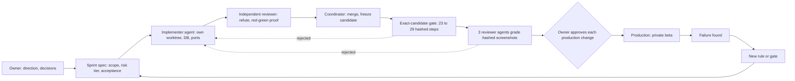

# MovieCellar: four platforms built by agent fleets, and the machinery that decides what ships

*Status: private repository. In production on a private beta with no real users yet; the last release shipped on 2026-09-19 and later sprints, including a security remediation, are unreleased. Claude Code and Codex agents wrote the code. I set the direction, specified the work, designed the verification that decides what ships, and decide what reaches production.*

**At a glance**
- Web, iOS, a desktop agent and a vision service in 5.5 months: about 1,800 commits and 355k lines, a third of it tests and harness. Agents wrote it; I did not hand-write the product code.
- A Claude Code and Codex fleet: 100+ git worktrees, up to five concurrent lanes, three cross-vendor handoffs in 11 days.
- Two verification systems: a 23 to 29 step release gate that rejected a sprint after 16 attempts, and a two-round multi-agent security audit (194 findings; 113 agents in round one alone) whose delta review caught 6 regressions.

## The product and what the agents built

MovieCellar tracks a personal digital movie and TV collection: import an Apple TV library, then manage ownership, wishlist, diary, price history and drops, and friends. The agents built a Next.js 14 web app (188 route handlers, 88 Prisma models on Postgres), an Expo mobile app (iOS through TestFlight; Android on an emulator for the gate), a Tauri/Rust desktop agent, a self-hosted Qwen-VL vision service as an import fallback, Inngest jobs (pricing four times a day) and an AI assistant, on Vercel and Neon. Every LLM feature ships with its own eval: the import matcher scores against a 177-case gold set, and an injected scorer bug drops it to 0/177; the assistant's 14 graders are proven to fail when its behavior breaks. The assistant is unreleased.

## How the work is organized

Work runs in numbered sprints (112 allocated). Before any code, a spec fixes the outcome, file boundaries, model and effort per workstream, a risk tier and the acceptance checks. Each unit then runs plan, execute, verify: an implementer agent builds in its own worktree, a separate reviewer told to refute rather than bless re-runs the evidence, and objective gates must pass. Review depth follows a five-tier risk scale, from a self-check for docs to a rehearsal on production-like data and a committed rollback for schema changes. The decision on a production write or any other irreversible action is never delegated, and chat approval is not enough. When the harness's permission classifier blocked a production migration I had approved in chat, I switched to manual mode, where each production command prompts and agents execute only after I approve it. Direction, the product experience and irreversible calls stay with me.

Rules are written as failures happen. A ten-rule lint gate encodes recurring mistakes, each with a failing and a passing fixture and a message that states the fix. It began with five rules, and its first run found a query that had been silently failing, and swallowed, since Sprint 050.

## A two-vendor fleet

Claude Code and Codex share one repository (about 420 Codex threads in the last month, 500+ retained Claude subagent runs). Collisions are prevented by mechanism, not etiquette.

- **Lanes.** Each has its own worktree, throwaway database container and port range; the emulator and acceptance database belong to one lane at a time.
- **Run lease.** A create-exclusive lock covers ports, fixture database and emulator. Release checks ownership; recovery refuses a live or unknown owner. In Sprint 107 it stopped a second gate from starting on one emulator.
- **One writer per file.** Explicit-pathspec staging, no bare stash, shared files reserved to the coordinator.
- **Freeze and merge.** One coordinator writes the integration worktree. Packages arrive with branch, head, commands, reviewer and verdict, and merge with `--no-ff`; a different lane reviews security-sensitive work; after `FREEZE <sha>` only gate repairs land.

Handoffs on Sep 18, 22 and 29: two came from a vendor usage limit, one from Codex stopping at a clean checkpoint. State lives in the repo: a resume runbook, a private checkpoint file and a hash-checked knowledge index. A fresh agent given only the checkout has passed a twelve-question exercise (36 of 36 checks) three times. After the last takeover, the first device run found a real bug within two hours: a permission prompt re-raised every 130 ms after a denial. An audit of 54 Codex subagent launches found every one on the top model tier at high effort, so the plan now routes by role.

## The release gate

Since mid-September, feature work must pass an exact-candidate gate. Before coding, the sprint lists every changed product file and the visible outcomes, each mapped to named browser or device checks; the runner refuses uncovered files. On a frozen candidate it runs 23 to 29 steps as coverage grew: lint, typecheck, a production build and smoke test, 265 to 315 Playwright checks, and 17 to 23 Android groups on an APK whose hash must equal the installed one. It records the source commit and content hash before and after, and voids the run if they move. Undeclared skips, retries, focused tests and flaky passes block; baselines are never updated to clear a failure. A run can end `checks-passed`, never ready: three independent reviewer agents each grade a third of the screenshots (up to 141) after recomputing every hash, and a finalizer prints `web-android-functional-ready` only if hashes and source still match.

What it has rejected:

- **Sprint 102b** passed all 23 steps, then failed image review on 8 P2 and 3 P3 findings. I authorized a UI-fix sprint rather than relax the review; the re-run passed and shipped.
- **Sprint 107** took 16 attempts over about 14 hours. Most failures were defects in tests, fixtures and the harness, some were real product bugs, and one agent's "ordering artifact" diagnosis was wrong and cost an attempt. Attempt 16 passed all 29 steps; reviewers then rejected it over five classes of mobile layout defect that its new device phases photographed for the first time. It did not land.
- **Sprint 110** failed one website check, so Android never started.
- Reviewers also reject weak evidence, such as byte-identical screenshots under different names.

## The security audit

The audit was read-only, over a frozen snapshot in a worktree with no secrets or database access. Round one used 37 finders: 31 sliced by surface on mid-tier models, 2 process auditors, and 4 whole-app chain analyses on the strongest model at extra-high effort. Each batch went to two Opus-class skeptics with different lenses, reachability and source correctness against existing mitigations; a finding is dropped only if both refute it. Two critics then hunted for gaps, eight more finders filled them, and the session lead arbitrated every P1 candidate against the source. Round one took 54 minutes, 113 agents and 17.3M tokens; ten agents died on a usage limit, and a follow-up verified only the 46 findings still missing verdicts. Of 221 candidates, 14 were refuted and 13 merged, leaving 194 findings (6 P1, 68 P2, 120 P3). Finders had proposed 12 P1s.

Remediation ran in 13 groups, each in its own worktree with a throwaway database. Every fix carried a rejection test that had to fail on the old code and pass on the new, re-run by an independent reviewer; nine groups needed a repair round. I granted a scoped standing authorization for the production changes the fixes needed, with rehearsal, rollback and per-command logging still required. The structural change was a default-deny gate over 187 route handlers and 262 server-action exports.

A whole-branch delta review (15 agents, 2.7M tokens) re-ran the chain analyses and a closure check on every P1 and P2. It confirmed 63 closed and caught 6 regressions the per-group reviews missed, because each reviewer had attacked only its own diff. Three would have done real damage: a backfill that could have overwritten stored privacy choices (a read-only production check showed it would not have fired on this release), a new gate that blocked assets signed-out clients need, and a fix that opened a gap between accounts. It also found seven findings no group brief had routed, a gap in the coordinating agent's plan; three repair groups then closed them. I do not describe individual findings: the fixes are unreleased, and counts are findings, not confirmed exploits.

## Failure to rule

| Incident | Rule it produced |
|---|---|
| A "harmless" backfill flipped 3,770 production rows with no clean revert; a code fix existed. | Production writes need my approval of the exact change, every time. Prefer code fixes; a "small dry run" that writes a row is a write. Scripts that can reach production refuse by default. |
| A worktree copied an env file with the production database URL; security tests would have run against it. | Throwaway databases behind a guard, tests that must run rather than skip, no env files in worktrees, target verified by row count. |
| Parallel agents' commits and writes landed in the main checkout (11+ times). | Every git command targets its worktree; write paths are worktree-prefixed; check both checkouts after each write. |
| All four streams of a sprint reported complete; three were not (an unreachable screen, a dead link, a flag that compiled the feature out). | Verify the shipped artifact and running system, never the summary. |
| A route-reachability suite stayed green after the route it guarded was deleted; its test vanished instead of failing. | Every new gate gets a "break it, confirm red" proof; generated cases use live discovery plus a committed snapshot. |
| A guard's floor exceeded the population it bounded, so it never fired on small collections; its twin had the same flaw. | Test guards at the smallest real population; grep for the twin after each fix. |

## Honest limits

- **No real users.** It is a private beta; I have not seen it under real usage.
- **Recent work is unreleased.** Production runs the 2026-09-19 candidate. The security remediation, the assistant and other later sprints are finished locally, not shipped. The combined candidate has not passed the gate, and 12 security criteria still lack runtime proof.
- **The gate is narrow and young.** It covers web and an Android emulator, not iOS, the desktop app, store signing or production networking. Two releases have passed through it; the first shipped a commit that differed from the gated candidate in five files, disclosed but not gated.
- **Agents mis-report completion.** Beyond the sprint above: a recap blamed 38 stale knowledge dependencies on "pre-existing debt" when the sprint itself had caused them, and an audit agent called an open defect resolved. I still check.
- **It is not cheap.** One sprint took 16 gate attempts, and the fleet repeatedly hit vendor usage limits.

Numbers are as of 2026-09-29; the repository changes daily.

## What transfers

Agents make generation cheap; verification is the scarce part. Make the protocol mechanical, give every check a way to fail, and turn each incident into a rule. The reusable version is [the playbook](../playbook/README.md); six gate screenshots (fixture data, third-party poster art) are in [images](../images/).
