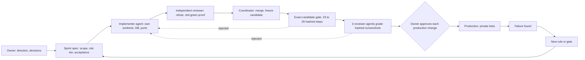

# MovieCellar

**Status:** Private repository. In production as a private beta with no real users yet. The last release shipped on 2026-09-19, and later sprints, including a security remediation, are unreleased.

**Who did what:** Claude Code and Codex agents wrote the code, and I did not hand-write any of it. I set the direction, wrote the specs, designed the checks that decide what ships, and decide what reaches production.

**Result:** Agents built web, iOS, a desktop agent, and a vision service in 5.5 months, with about 1,800 commits and 355k lines (a third of it tests and harness).

## Product

MovieCellar tracks a personal digital movie and TV collection, starting from an Apple TV library import.

**Built by agents:** A Next.js 14 web app (188 route handlers, 88 Prisma models on Postgres), an Expo mobile app (iOS through TestFlight, Android on an emulator for the gate), a Tauri/Rust desktop agent, and a self-hosted Qwen-VL vision service as an import fallback. The agents also built Inngest jobs (pricing runs four times a day) and an AI assistant, on Vercel and Neon.

**Evals:** Every AI feature has its own test set. The import matcher scores against 177 known cases, and an injected scorer bug drops it to 0 of 177. The assistant's 14 graders were shown to fail when its behavior breaks. The assistant is unreleased.

## Process

Work runs in numbered sprints, and 112 have been allocated. A spec comes first, and a separate reviewer told to refute the work re-runs the evidence. Review depth follows a five-tier risk scale.

I never delegate a production write or any other irreversible action, and approval in chat is not enough. After the permission classifier blocked a migration I had approved in chat, I switched to manual mode, where each production command prompts me.

Rules get written as failures happen. The lint gate began with five rules and has ten now, each with a failing and a passing fixture and a message that states the fix. Its first run found a query that had been failing silently since Sprint 050.

## Fleet

**Scale:** Claude Code and Codex share one repository, with 100+ git worktrees and up to five concurrent lanes, each with its own database container and ports. The last month had about 420 Codex threads and 500+ retained Claude subagent runs.

**Writes:** Only one agent writes a given file, and after `FREEZE <sha>` only gate repairs land.

**Run lease:** A lock covers the ports, fixture database, and emulator. In Sprint 107 it stopped a second gate from starting on one emulator.

**Handoffs:** Three cross-vendor handoffs in 11 days (Sep 18, 22, and 29), two from a vendor usage limit and one from Codex stopping at a clean checkpoint. State lives in the repo. A fresh agent given only the checkout passed a twelve-question exercise (36 of 36 checks) three times. After the last takeover, the first device run found a real bug within two hours, a permission prompt that re-raised every 130 ms after a denial.

**Model routing:** An audit of 54 Codex subagent launches found every one on the top model tier at high effort, so the plan now routes by role.

## Release gate

Since mid-September, feature work must pass an exact-candidate gate. The runner refuses any changed product file that no named browser or device check covers.

**Steps:** 23 to 29 on a frozen candidate, as coverage grew. They include lint, typecheck, a production build, 265 to 315 Playwright checks, and 17 to 23 Android groups on an APK whose hash must equal the installed one.

**Blocks:** Undeclared skips, retries, and flaky passes block a run. A moved source commit or content hash voids it. Baselines are never updated to clear a failure.

**Review:** The automated steps can only end a run as `checks-passed`. Three independent reviewer agents then each grade a third of the screenshots (up to 141) after recomputing every hash. A finalizer prints `web-android-functional-ready` only if the hashes and source still match.

**Sprint 102b:** It passed all 23 steps. However, it failed image review on 8 P2 and 3 P3 findings. I authorized a UI-fix sprint instead of relaxing the review, and the re-run passed and shipped.

**Sprint 107:** 16 attempts over about 14 hours. Most failures were defects in tests, fixtures, and the harness, some were real product bugs, and one agent's wrong "ordering artifact" diagnosis cost an attempt. Attempt 16 passed all 29 steps. However, the reviewers rejected it over five classes of mobile layout defect that its new device phases photographed for the first time. It did not land.

**Sprint 110:** One website check failed, so Android never started.

## Security audit

The audit was read-only, over a frozen snapshot with no secrets or database access.

**Round one:** 54 minutes, 113 agents, 17.3M tokens. It used 37 finders: 31 sliced by surface on mid-tier models, 2 process auditors, and 4 whole-app chain analyses on the strongest model. Two Opus-class skeptics reviewed each batch, and a finding was dropped only if both refuted it. Two critics hunted for gaps, eight more finders filled them, and the session lead arbitrated every P1 candidate against the source. Ten agents died on a usage limit, so a follow-up verified only the 46 findings still missing verdicts.

**Findings:** Of 221 candidates, 14 were refuted and 13 merged, which left 194 findings (6 P1, 68 P2, 120 P3). The finders had proposed 12 P1s.

**Remediation:** 13 groups, nine of which needed a repair round. Every fix carried a rejection test that failed on the old code and passed on the new. I granted a scoped standing authorization for production changes, with rehearsal, rollback, and per-command logging still required. The structural change was a default-deny gate over 187 route handlers and 262 server-action exports.

**Delta review:** 15 agents and 2.7M tokens re-checked every P1 and P2 with the chain analyses and a closure check. They confirmed 63 closed and caught 6 regressions that the per-group reviews missed. This makes sense, because each reviewer had attacked only its own diff. Three would have done real damage. A backfill could have overwritten stored privacy choices, although a read-only production check showed it would not have fired on this release. A new gate blocked assets that signed-out clients need. A fix opened a gap between accounts. The review also found seven findings that no group brief had routed, which was a gap in the coordinating agent's plan. Three repair groups then closed them.

**Not described:** Individual findings, because the fixes are unreleased. The counts are findings that have not been confirmed as exploits.

## Failures and rules

| Incident | Rule it produced |
|---|---|
| A "harmless" backfill flipped 3,770 production rows with no clean revert, though a code fix existed. | Production writes need my approval of the exact change, and a "small dry run" that writes a row is a write. Scripts that can reach production refuse to run by default. |
| A worktree copied an env file with the production database URL, so security tests would have run against it. | Tests use throwaway databases behind a guard. |
| Parallel agents' commits and writes landed in the main checkout (11+ times). | Git commands and write paths target the agent's own worktree. |
| All four streams of a sprint reported complete, and three were not (an unreachable screen, a dead link, a flag that compiled the feature out). | Checks run against the shipped artifact and ignore the agent's summary. |
| A route-reachability suite stayed green after its route was deleted, because the test vanished instead of failing. | Every new gate gets a "break it, confirm red" proof. |
| A guard's floor was higher than the population it bounded, so it never fired on small collections. | Guards are tested at the smallest real population. |

## Limits

**No real users:** I have not seen it under real usage.

**Unreleased work:** The combined candidate has not passed the gate, and 12 security criteria still lack runtime proof.

**A narrow, young gate:** It covers web and an Android emulator. iOS has its own automated suite on a simulator, run outside the gate. Neither covers the desktop app, store signing, or production networking. Two releases have passed through the gate, and the first shipped a commit that differed from the gated candidate in five files (disclosed, but not gated).

**Agents mis-report completion:** A recap blamed 38 stale knowledge dependencies on "pre-existing debt" when the sprint itself had caused them. An audit agent called an open defect resolved. So an agent's report of done doesn't count until a check or a separate reviewer agent confirms it.

**Cost:** It is not cheap, and the fleet repeatedly hit vendor usage limits.

The numbers are as of 2026-09-29, and the repository changes daily.

## What transfers

Agents make code cheap to write, so verification is the scarce part. I would make the protocol mechanical and give every check a way to fail. Each incident should become a rule. The reusable version is [the playbook](../playbook/README.md). Six gate screenshots (fixture data, third-party poster art) are in [images](../images/).
